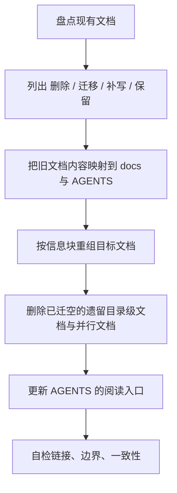

# 项目文档

这份 skill 的目标不是“把旧文档润色得更像规范”，而是让 Agent 能把 LinguaGacha 的长期项目文档**整理、迁移并落地为固定的目标形态**。必要时可以在内容组织上整篇重写目标文档；但实际编辑仍应按章节或信息块分步修改，让 diff 保持可审阅、可回滚。判断内容去留时不以“改动最小”为目标，而以最终结构正确、边界清楚、可持续维护为先。

## 交付形态

使用这份 skill 整理仓库文档时，交付结果必须收口为下面这套固定形态：

```text
AGENTS.md
docs/
  ARCHITECTURE.md
  API.md
  FRONTEND.md
  WORKFLOW.md
  DATA.md
```

### 硬门闩

1. 交付后的稳定项目文档必须集中到根目录 `AGENTS.md` 与 `docs/` 目录。
2. 交付后的 `docs/` 根目录只保留上面这 5 份长期权威文档，不增加并行总纲或额外长期权威文档。
3. 生成物、归档材料、任务临时文档或外部规范镜像不属于长期权威文档；若确需保留，应放入明确子目录或任务位置，不与根目录 `AGENTS.md` 或 `docs/` 根目录文档并列争夺权威。
4. 目录级遗留文档不属于交付后的长期文档形态；若其中仍承载稳定规则，默认动作是迁移到 `AGENTS.md` 或对应 `docs/*.md`。删除前必须确认稳定规则已迁移、链接与引用已更新、该文件不再是阅读路径或工具链入口。
5. 交付后的 `AGENTS.md` 只保留 Agent 协作规则、仓库级硬约束、直接约束 Agent 编码行为的开发原则与技术栈风格硬约束、阅读起手式与交付要求，不承载专题文档主体内容。
6. 如果旧文档结构已经不适合交付形态，可以按章节或信息块重写目标文档，不需要为了保留旧段落做补丁式迁移。
7. 除非用户明确要求，否则不要新增额外长期权威文档。

## 5 份目标文档的职责

| 文档 | 必须回答的问题 | 不该承载的内容 |
| --- | --- | --- |
| `docs/ARCHITECTURE.md` | `docs/` 内主入口在哪里，系统如何分层，跨层边界与阅读路径是什么 | API 字段表、前端设计细节、任务流程清单 |
| `docs/API.md` | 本地 HTTP / SSE 契约、bootstrap、topic、错误码、同步 mutation 规则是什么 | Python 内部实现过程、页面布局说明 |
| `docs/FRONTEND.md` | Electron / preload / renderer / 运行态消费边界是什么 | 视觉 token、品牌语义、API 错误码表 |
| `docs/WORKFLOW.md` | 任务起手式、验证要求、文档同步规则、交付自检是什么 | 模块实现细节、协议字段表 |
| `docs/DATA.md` | Python Core 内部数据域职责、状态落点、唯一写入口是什么 | 前端设计规则、纯协作口号 |

## 何时使用

- 需要把仓库文档整理成上面的交付形态
- 需要迁移仓库中的目录级遗留文档
- 需要删除失效文档、合并重复规则、补写缺失边界
- 需要判断某条稳定事实应写进 `AGENTS.md` 还是哪一份 `docs/*.md`
- 需要把 `AGENTS.md` 从“文档正文承载者”收回成“Agent 协作入口 + 编码硬约束入口”

不要用于：

- PR 描述、提交说明、任务纪要、迁移日志、临时排查笔记
- 代码、目录结构或类型定义一眼就能看出的表面事实

## 收录标准

只有同时满足下面四个条件的信息，才值得进入长期文档：

| 条件 | 说明 | 不满足时怎么做 |
| --- | --- | --- |
| 未来维护必须知道 | 不知道就容易改错落点、越过边界、破坏契约 | 删除 |
| 代码或目录不够显然 | 不能只靠看文件名、函数名、局部实现就立刻得出 | 删除 |
| 当前仍然有效 | 它描述的是此刻成立的稳定事实，而不是旧规则或过渡过程 | 删除或改写 |
| 有固定归宿 | 它能落进 `AGENTS.md` 或 5 份 `docs/*.md` 之一 | 迁移、合并或删除 |

判断公式：

> 必须知道 + 非显然 + 当前有效 + 有固定归宿 = 值得写进长期文档

## 不收录的内容

| 类型 | 为什么不该写 | 正确归宿 |
| --- | --- | --- |
| 本次任务怎么改过来的 | 这是过程，不是长期知识 | Git、PR、任务记录 |
| 旧规则已经失效 | 它不再指导未来维护 | 直接删除 |
| `A 不再负责 B` 这类否定残影 | 它仍在借旧世界解释现在 | 改写为当前规则或删除 |
| 代码表面事实 | 文档只是在重复代码 | 删除 |
| 目录清单式描述 | 除非在表达阅读路径或权威来源，否则价值很低 | 删除或收口为入口说明 |
| 只在当前任务语境里成立的信息 | 离开上下文就失效 | 删除 |

## 执行原则

1. 先判断信息去留与归宿，再动文笔。
2. 先删、再并、再迁、再补，最后才统一改写。
3. 可以按信息块重组目标文档，但不要把旧结构原样搬家。
4. 同一条稳定事实只保留一个权威版本，其他文档只做必要引用。
5. 如果本轮目标是迁移、收口或清理长期文档，却没有发生删除、迁移、合并或补写，只发生措辞替换，默认说明整理力度不足。若用户明确要求润色、术语统一或歧义消除，则可以只做措辞层面的精修。

## 迁移主流程



按下面顺序执行：

1. 盘点现有文档：`AGENTS.md`、`docs/*.md`、以及仓库中的遗留目录级文档
2. 列出四类对象：删除候选、迁移候选、必须补写的缺口、可保留事实
3. 建立迁移映射：把旧文档内容逐条映射到 5 份 `docs/*.md` 与 `AGENTS.md`
4. 按信息块重组目标文档：不必保留旧节名、旧段落顺序或旧目录划分
5. 迁移完成并通过删除前检查后，删除失去价值的遗留目录级文档或并行文档
6. 更新 `AGENTS.md`，只保留协作入口、硬约束、编码硬约束、验证与交付要求
7. 自检所有链接、阅读路径、文档边界与规则一致性

删除遗留文档或并行文档前必须完成下面三项检查：

- 稳定规则已经迁移到 `AGENTS.md` 或对应 `docs/*.md`
- 仓库内指向该文件的链接、阅读路径和引用已经同步更新
- 该文件不是脚本、工具链、外部流程或用户明确指定的入口

## 遗留来源

下面这些对象如果出现在仓库里，只能作为迁移输入、归档材料或反例理解，不属于交付后的长期权威文档：

- 目录级 `SPEC.md`
- 任何平行于固定文档集合之外、且试图承担长期权威入口职责的 `docs/*.md`
- 承载任务过程、迁移过程、阶段性讨论的说明文档

其中，目录级 `SPEC.md` 在当前仓库里是**遗留迁移来源**，不是目标形态的一部分。生成物、归档、临时任务材料如果有明确子目录和生命周期，不按并行长期文档处理。

## 遗留来源到新文档的默认映射

| 遗留来源或遗留内容 | 默认新归宿 |
| --- | --- |
| `docs/ARCHITECTURE.md` 里的文档地图、系统分层、跨层关系 | `docs/ARCHITECTURE.md` |
| `api/SPEC.md` 中的 HTTP / SSE / bootstrap / mutation 契约 | `docs/API.md` |
| `frontend/SPEC.md`、`frontend/src/renderer/SPEC.md`、`frontend/src/renderer/app/project-runtime/SPEC.md` 中的前端边界与运行态消费规则 | `docs/FRONTEND.md` |
| 任务起手式、验证矩阵、文档同步规则、交付自检 | `docs/WORKFLOW.md` |
| `module/Data/SPEC.md`、`module/Engine/SPEC.md`、`module/File/SPEC.md`、`module/Model/SPEC.md` 中的数据域职责与状态落点 | `docs/DATA.md` |
| Agent 协作方式、仓库级硬约束、编码硬约束、阅读起手式 | `AGENTS.md` |

## 文档落点判断

判断一条信息写到哪里时，按下面这张表落点：

| 这条信息主要在回答什么 | 优先归宿 |
| --- | --- |
| `docs/` 内主入口、阅读路径、系统分层、跨层边界、运行时主链路 | `docs/ARCHITECTURE.md` |
| 本地 HTTP / SSE 契约、bootstrap、topic、错误码、同步 mutation 规则 | `docs/API.md` |
| Electron / preload / renderer / 项目运行态消费边界 | `docs/FRONTEND.md` |
| 任务起手式、验证要求、文档同步规则、交付自检 | `docs/WORKFLOW.md` |
| Python Core 内部数据域职责、状态落点、唯一写入口 | `docs/DATA.md` |
| Agent 协作规则、仓库级硬约束、编码硬约束、阅读起手式、交付要求 | `AGENTS.md` |

如果你在两个文档之间犹豫，优先问：

- 这条规则是在指导“系统怎么分层”，还是在指导“某类任务怎么做”？
- 这条规则是协议契约、前端边界、任务流程，还是数据域职责？
- 这条规则若写进 `AGENTS.md`，会不会让 `AGENTS.md` 胀成专题文档？
- 这条规则若写进专题文档，是否还能保持唯一权威归宿？

## 每份文档建议的章节骨架

### `docs/ARCHITECTURE.md`

- 一句话总览
- 系统分层图
- 跨层边界
- 运行时主链路
- 文档地图与推荐阅读顺序
- 模块关系矩阵

### `docs/API.md`

- 一句话总览
- 协议消费者与边界
- 路由族与路径前缀
- HTTP 响应壳
- 错误码边界
- SSE / bootstrap / patch 规则
- 同步 mutation 与异步任务的区别

### `docs/FRONTEND.md`

- 一句话总览
- `main / preload / shared / renderer` 边界
- `window.desktopApp` 与 `desktop-api.ts` 的唯一入口约束
- 运行态消费与 `ProjectStore`
- 页面 / widget / shadcn / 样式归属
- 前端与 API / 外部设计系统的接缝

### `docs/WORKFLOW.md`

- 任务起手式
- 常见任务类型的阅读路径
- 最低验证要求
- 文档同步规则
- 交付前自检清单

### `docs/DATA.md`

- 一句话总览
- `Data / Engine / File / Model` 的职责边界
- 状态拥有者与唯一写入口
- SQL 唯一落点
- 典型数据流
- 新状态应归属哪里的判断规则

## `AGENTS.md` 的收口规则

`AGENTS.md` 只保留下面这些内容：

- Agent 协作方式
- 仓库级硬约束
- 直接约束 Agent 编码行为的仓库级开发原则
- 分技术栈的实现风格硬约束
- 任务起手式的最简入口
- 先读哪些 `docs/*.md`
- 最低验证与交付要求

不要把下面这些内容继续塞进 `AGENTS.md`：

- API 字段、topic、bootstrap stage 细节
- 前端目录职责与运行态细节
- 视觉 token、组件语言样本
- Python Core 数据域边界正文

## 重写规则

使用这份 skill 时，允许并鼓励下面这些动作：

- 整篇重写目标文档
- 合并多份旧文档到一份新文档
- 拆掉旧节名、旧顺序、旧目录划分
- 删除迁移后已失去价值的遗留目录级文档

不要做下面这些动作：

- 为了“改动小一点”保留旧结构
- 在旧段落后面追加补丁式说明
- 把历史迁移过程写进长期文档
- 一边声明迁移完成，一边继续保留并行长期文档

## 红旗句式

看到下面这些句式时，默认停下来重审：

- `不再...`
- `已经不是...`
- `之前...现在...`
- `原本...现在...`
- `为了这次改动...`
- `这里改成了...`

这些句式通常意味着文本还在借历史解释现在，而不是直接陈述当前规则。

## 删改模板

| 遇到的写法 | 处理方式 |
| --- | --- |
| `A 不再负责 B` | 改写为 `B 由 C 负责` |
| `之前通过 X，现在改为 Y` | 改写为 `当前通过 Y ...` |
| `为了修复某问题，这里...` | 能沉淀为长期规则就改写；不能就删除 |
| `目录下有 A、B、C` | 只是复述结构就删除；只有在表达阅读路径或权威来源时才保留 |
| `这里新增了一个...` | 只是描述本次改动就删除；形成长期边界才改写为当前事实 |

## 汇报格式

整理完成后，优先按**信息集合变化**汇报，而不是按操作过程汇报：

| 文档 | 删除了什么 | 迁移/合并了什么 | 补写了什么 | 保留理由 |
| --- | --- | --- | --- | --- |
| `...` | `...` | `...` | `...` | `...` |

汇报约束：

- 先说删、并、移、补，再说措辞优化
- 如果某份文档只有措辞改写，没有信息集合变化，要明确说明为什么
- 如果某份旧文档已迁空并删除，要明确指出

如果任务只是判断某条规则归宿、做小范围修订或评审文档边界，可使用轻量汇报：

| 结论 | 归宿 | 理由 | 是否改文档 |
| --- | --- | --- | --- |
| `...` | `...` | `...` | `...` |

## 自检清单

- 整理完成后的长期文档是否真的收口为固定的 5 份 `docs/*.md` 加 `AGENTS.md`？
- 遗留目录级文档是否还残留稳定规则正文？
- `AGENTS.md` 是否只保留协作入口、仓库级约束与编码硬约束，而没有重新长回专题正文？
- 各文档之间是否仍有大段重复规则？
- 是否还残留历史参照、迁移叙事、补丁式残影？
- 不知道历史的人，只读当前文档，能否做出正确维护判断？

## 失败信号

出现下面任一情况，默认说明这轮整理没有达到预期：

- 只是把旧文档措辞改顺，没有改变信息集合
- 遗留目录级文档仍然留着当正文文档
- `AGENTS.md` 仍然承担专题文档主体内容
- `docs/` 下仍出现并行总纲或额外长期文档
- 读完后仍需要在多份旧文档之间来回拼图
