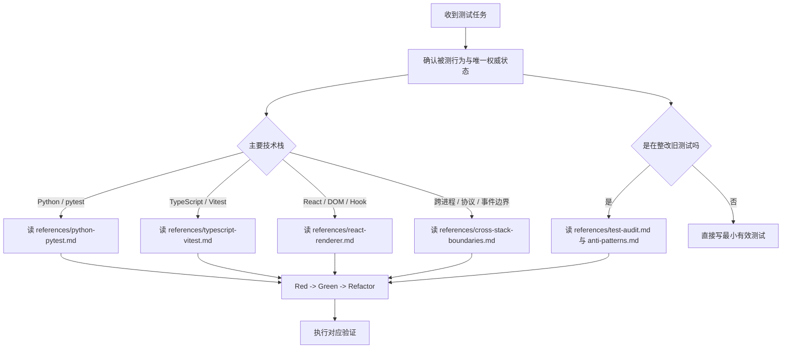

# Project Tests

按这套规则做项目测试：先证明可观察行为，再补实现细节；先加载通用判断，再按任务逐步读取对应技术栈示例。

## 核心目标

- 让测试回答“功能有没有按要求工作”，而不是“内部是不是刚好这样写”
- 让测试在重构后依然稳，只要行为没变就不该大面积失效
- 让测试一眼能看懂，最好就是 `Arrange -> Act -> Assert`
- 让边界可控，不碰真实网络，不依赖脏磁盘数据
- 让不同技术栈的测试遵守同一套业务语义

## 起手流程



1. 先确认需求、边界、错误分支和状态拥有者。
2. 优先写一个会失败的行为测试，再实现或修正代码。
3. 只加载当前任务需要的参考文件，不把所有示例塞进上下文。
4. 若需要查库或框架 API，使用 `$find_docs` 查最新官方文档。
5. 验证范围随风险扩大：目标测试 -> 对应测试套件 -> 格式化、lint、类型检查。

## 硬门闩

1. 每个业务文件有且仅有一个对应测试文件。
2. 与某个业务文件相关的单测、边界用例、回归用例必须收敛到这个对应测试文件中。
3. 公用夹具、测试工具、测试数据 builder 可以独立成文件；它们不能承载某个业务文件的具体断言。
4. 只有跨多个业务文件的真实集成场景，才允许放入独立集成测试文件；文件名必须表达场景边界，而不是复刻某个业务文件名。
5. 新增测试前先查找对应测试文件；找不到时创建一个，不要为同一业务文件新建第二个平行测试文件。
6. 整理旧测试时宁缺毋滥；没有实际业务价值、脱离当前逻辑、理论上可达但实践中基本不可触达的用例，应修改、合并或清理。
7. 允许为提升测试效果做业务透明重构；重构只能改善可测性和边界表达，不得改变业务功能。

## 通用规则

1. 先走 `Red -> Green -> Refactor`。
2. 优先断言可观察行为，不把内部实现当主要断言对象。
3. 外部边界才 mock；同仓库内部模块能跑真逻辑就跑真逻辑。
4. 每个测试都要证明一条明确需求、边界或错误分支，并且失败时能说明问题。
5. 测试名直接说业务意图，不写 `test_it_works`、`should handle case` 这类空话。
6. 测试数据要有语义，能让读者看出场景。
7. 不为覆盖率数字制造孤儿用例；只补真实需求、边界和历史缺陷。

## 断言什么

优先断言这些公开结果：

| 优先对象 | 典型例子 |
| --- | --- |
| 输入输出 | 返回值、抛错、生成内容 |
| 最终状态 | 状态字段、对象快照、可读取配置 |
| 公开事件 | 事件类型、事件载荷、回调结果 |
| 持久化结果 | 数据库记录、写入文件、缓存对外视图 |
| UI 结果 | DOM 文本、按钮状态、可见状态、用户触发后的公开回调 |
| 运行态信号 | store 快照、change signal、事件 topic、初始化阶段载荷 |

如果一个断言只能说明“内部刚好这么实现”，就先停下来改写测试。

## 跨栈边界

| 边界 | Python 侧推荐 | TypeScript / React 侧推荐 |
| --- | --- | --- |
| 文件系统 | `pyfakefs` 的 `fs` | 用小型内存适配器或 mock 宿主 API，避免真实用户目录 |
| SQLite | `:memory:` 或等价内存数据库 | 不直接碰数据库，断言 API 载荷或 store 快照 |
| 网络 / 外部 SDK | `patch` 使用点或 fake client | `vi.mock` 使用点，断言公开结果后再校验调用 |
| 时间 / 随机数 | patch 时间源或注入 clock | `vi.useFakeTimers()`、注入 clock 或稳定 id |
| 事件流 | 记录 topic 与 data | 用事件流 stub 触发公开事件监听 |
| React 状态 | 不适用 | 通过 DOM、hook 探针或 provider 快照断言 |
| 宿主桥接 | 不绕过公开桥接层 | mock 桥接适配器，不在 UI 测试里直连系统 API |

## 参考文件路由

| 任务 | 先读 |
| --- | --- |
| Python 单测、service、数据访问、线程任务 | [references/python-pytest.md](references/python-pytest.md) |
| TypeScript 纯函数、状态容器、selector、异步调度 | [references/typescript-vitest.md](references/typescript-vitest.md) |
| React Hook、Context、页面状态、组件交互 | [references/react-renderer.md](references/react-renderer.md) |
| 后端与前端、宿主与 UI、协议与事件流边界 | [references/cross-stack-boundaries.md](references/cross-stack-boundaries.md) |
| 检查映射关系、逐用例审查、清理低价值测试、业务透明重构 | [references/test-audit.md](references/test-audit.md) |
| 整改旧白盒测试、mock 滥用、测试组织失焦 | [references/anti-patterns.md](references/anti-patterns.md) |

## 文件组织

- Python 测试通常放在集中测试目录，TypeScript/React 测试通常靠近被测模块；以项目现有约定为准。
- 测试文件和业务文件必须一一对应：一个业务文件只对应一个测试文件，一个测试文件也只覆盖一个主业务文件；禁止一对多、多对一、多对多。
- 路径和文件名映射必须可解释、可重复、符合项目约定；发现错位时先统一映射，再迁移或合并用例。
- 对同一业务文件的新增行为、边界、错误分支和回归用例，必须追加到它的对应测试文件中。
- 不要按“成功场景 / 错误场景 / mock 场景”拆出多个平行测试文件。
- 夹具离使用位置越近越好；真正跨域稳定复用的夹具才上提。

## 旧测试整理流程

改旧测试时，按这个顺序最省事：

1. 读取 [references/test-audit.md](references/test-audit.md)，先建立业务文件和测试文件的一一映射表。
2. 再读 [references/anti-patterns.md](references/anti-patterns.md)，扫 `__new__`、`call_args`、`call_args_list`、`tmp_path`、`mock_open`、`print\(`、`vi.mock` 套娃、只测实现调用。
3. 逐一说明每个测试真正证明的业务行为；说不清、价值弱或当前业务不会触达的用例，不保留原样。
4. 把“内部调用断言”改成“结果快照断言”，或合并到更有业务价值的场景中。
5. Python 重复准备逻辑收进最近的 `conftest.py`，前端重复准备逻辑收进同目录 helper 或测试内工厂。
6. 能用真实内存 DB、虚拟文件系统、store 实例或事件流 stub，就不要手造假的系统壳。
7. 跑格式化、静态检查、类型检查和目标测试。

## 白盒巡检命令

```powershell
Get-ChildItem -LiteralPath tests -Recurse -File -Filter "*.py" |
  Select-String -Pattern "__new__|call_args|call_args_list|tmp_path|mock_open|print\("

Get-ChildItem -LiteralPath <ts-source-root> -Recurse -File -Include "*.test.ts","*.test.tsx" |
  Select-String -Pattern "toHaveBeenCalled|mock\\.calls|vi\\.mock|console\\."
```

## 常用命令

```powershell
uv run pytest tests/ -v

npm --prefix frontend run test
```

## 提交前检查

- 测试名能直接说清业务意图
- 测试结构清楚，最好就是 `Arrange / Act / Assert`
- 测试文件与业务文件保持一一对应，没有为同一业务文件新增第二个平行测试文件
- 已逐一审查用例价值，清理或合并孤儿用例、凑数用例和当前业务基本不会触达的用例
- 没有新增白盒断言、mock 套娃和旧反模式
- 没有不必要的控制台输出，除非输出本身就是被测行为
- 业务透明重构只改善可测性，没有改变对外功能
- Python 夹具放在合适的 `conftest.py`，前端 helper 没有过早全局化
- 文件系统、数据库、网络、宿主桥接、事件流边界处理符合本规则
- 跑过与改动层级匹配的验证

## 验证下限

| 变更类型 | 最低验证 |
| --- | --- |
| Python 测试或实现 | 项目格式化 -> Python lint -> Python 测试 |
| 协议、事件流或初始化契约 | 后端测试 + 前端消费测试 + 契约相关回归 |
| TypeScript 纯逻辑 | 项目格式化 -> TS lint -> Vitest -> TypeScript 类型检查 |
| React / UI 状态 | 前端格式化、lint、Vitest、类型检查，并按需做视觉或交互审计 |
| 宿主桥接或共享契约 | 宿主侧类型检查 + UI 侧消费测试 |
