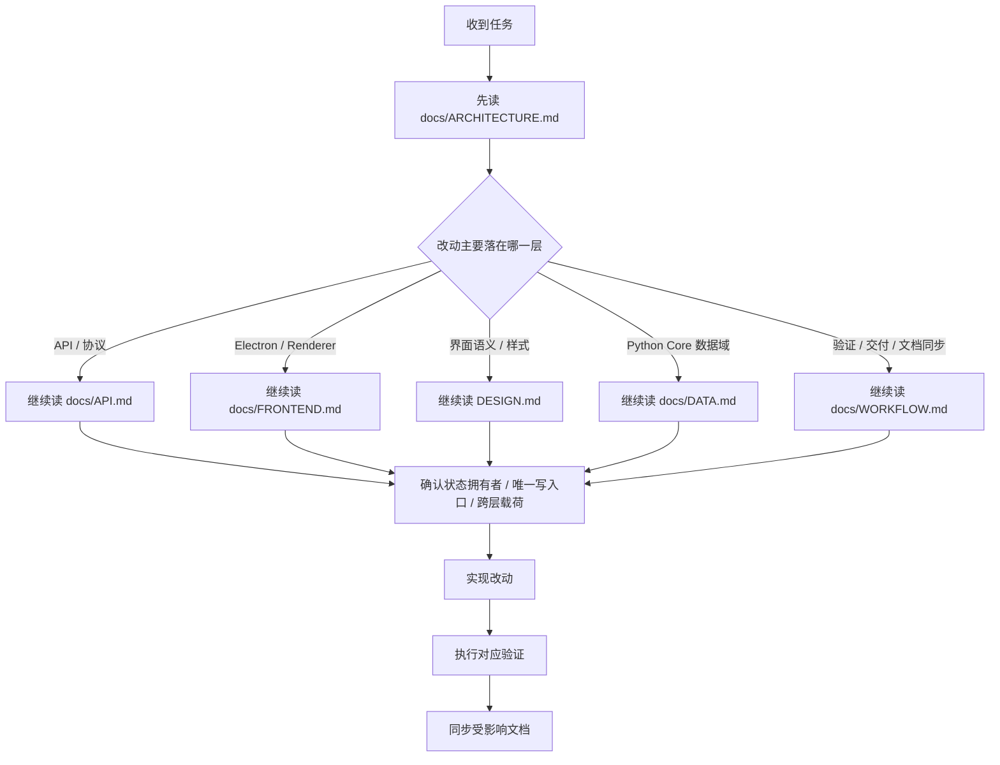

# LinguaGacha Agent 协作指南

本文件只保留 Agent 协作入口、仓库级硬约束、直接约束实现的编码硬约束、阅读起手式、验证下限与交付要求。专题规则统一收口到根目录 `DESIGN.md` 与 `docs/` 目录。

## 1. 任务起手式

| 任务类型 | 起手阅读顺序 |
| --- | --- |
| 仓库整体结构、阅读路径、跨层关系 | [`docs/ARCHITECTURE.md`](docs/ARCHITECTURE.md) |
| 本地 HTTP / SSE 契约、bootstrap、错误码 | [`docs/ARCHITECTURE.md`](docs/ARCHITECTURE.md) -> [`docs/API.md`](docs/API.md) |
| Electron 壳层、preload、共享桥接、渲染层分层 | [`docs/ARCHITECTURE.md`](docs/ARCHITECTURE.md) -> [`docs/FRONTEND.md`](docs/FRONTEND.md) |
| React 页面、组件、样式、交互语义 | [`docs/ARCHITECTURE.md`](docs/ARCHITECTURE.md) -> [`DESIGN.md`](DESIGN.md) -> [`docs/FRONTEND.md`](docs/FRONTEND.md) |
| Python Core 数据域、状态落点、唯一写入口 | [`docs/ARCHITECTURE.md`](docs/ARCHITECTURE.md) -> [`docs/DATA.md`](docs/DATA.md) |
| 验证矩阵、文档同步、交付自检 | [`docs/WORKFLOW.md`](docs/WORKFLOW.md) |

规则：
- 改代码前先确认状态拥有者、唯一写入口与事件回流路径，不能只按目录名推断。
- 长期文档只记录未来维护必须知道、且不能轻易从代码表面得出的当前有效事实。
- 改动若会让阅读路径、职责边界、协议语义或设计语义失真，必须在同一任务内同步修正文档。
- 删除或迁移遗留文档时，必须同步更新脚本报错、README、技能提示和测试断言里的文档入口，不能让工具链继续指向已迁空的目录级 `SPEC.md`。

## 2. 仓库级硬约束

### 2.1 运行时与通信边界
- LinguaGacha 是“无头 Python Core + Electron 桌面前端”的双进程工程。
- `api/` 是 Python Core 对外暴露的唯一 HTTP / SSE 协议边界；协议变化先看 [`docs/API.md`](docs/API.md)。
- 渲染层只通过 `window.desktopApp` 接入桌面宿主，再通过 `frontend/src/renderer/app/desktop-api.ts` 访问 Core API；禁止绕过 preload 直连 Node / Electron，也禁止在前端直接导入 Python 模块。
- 项目运行态主路径固定为 `/api/project/bootstrap/stream` 与 `/api/events/stream`；页面消费的是 bootstrap + `project.patch`，不是整页快照轮询。

### 2.2 状态落点与唯一写入口
- `module/Data` 持有工程事实与数据编排；工程、规则、分析、翻译结果与校对辅助优先判断是否属于这里。
- `module/Engine` 只负责后台任务生命周期、请求调度、停止与重试；不要让数据层或界面层吞掉任务语义。
- `module/File` 只负责格式解析与写回；文件格式支持变化不应散落在别处。
- `module/Model` 只负责模型配置类型、模板补齐、排序与默认回退，不承载页面快照或 HTTP 壳。
- 同一业务语义只允许一个权威来源与一个写入口；新增状态前先判断它属于 `ProjectSession`、领域 service、`DataManager`、`ProjectStore`，还是页面本地状态。
- SQL 只允许落在 `module/Data/Storage/LGDatabase.py`；API 层不得直接操作数据库，也不得持有 `ProjectSession`。

### 2.3 跨层载荷与长期文案
- 跨线程、跨模块、跨前后端只传 `id`、值对象或不可变快照，禁止共享可变对象引用。
- Python Core 的长期用户文案统一放在 `module/Localizer/`；渲染层长期文案统一放在 `frontend/src/renderer/i18n/`。
- 修改文案时要同步检查中英文资源是否语义一致，禁止把长期文案硬编码进业务实现。

## 3. 前端设计协作规则

- 涉及渲染层页面、组件、样式、布局或交互时，必须先读 [`DESIGN.md`](DESIGN.md)。
- `AGENTS.md` 只保留设计协作入口；产品气质、页面骨架、组件语言与主题语义以 [`DESIGN.md`](DESIGN.md) 为唯一权威。
- 设计层新增稳定规则时，先更新 [`DESIGN.md`](DESIGN.md)，再落代码；不要把长期设计决策散落在页面注释或临时说明里。

## 4. 实现约束

### 4.1 通用原则
- 改代码前先确认状态拥有者、唯一写入口和跨层载荷；不要只凭目录名做实现判断。
- 同一业务语义只允许一个权威来源；需要新增状态时，先判断它该落在领域层、运行态层还是页面局部状态。
- 代码注释和文档都优先解释“为什么这样约束”，不要重复代码表面行为。
- 代码改动如果会让阅读路径、实现边界或设计语义失真，必须在同一任务内同步修正文档。

### 4.2 Python
- 注释统一使用 `# ...`，重点解释“为什么这样做”，不要只复述代码表面行为。
- 命名遵循现有 Python 风格：变量与函数使用 `snake_case`，类使用 `PascalCase`，常量使用 `UPPER_SNAKE_CASE`；禁止首位下划线命名。
- 函数、类属性、实例属性与 `@dataclass` 字段必须显式标注类型；优先使用 `A | None`、`list[str]` 等现代类型写法。
- 数据载体优先使用 `dataclasses`；跨线程或跨边界传递的数据优先使用 `@dataclass(frozen=True)`。
- 魔术值要收口到常量、枚举或冻结数据对象；模块对外只暴露类，常量与枚举优先设计为类属性。
- 统一使用 `LogManager.get().debug/info/warning/error(msg, e)` 记录日志；记录异常时必须把 `e` 传入日志接口。
- 只有“预期且无害”的场景才允许 `except: pass`，并且必须用注释说明为何可以静默忽略；需要包装语义时使用 `raise ... from e` 保留异常链。
- 新增或调整本地 API 时，先判断它属于 `api/Application`、`api/Contract`、`api/Server/Routes` 还是 `api/Bridge`，不要只在某一层补丁式加逻辑。

### 4.3 Electron / TypeScript / React
- `frontend/src/main` 只负责 Electron 宿主、窗口、原生对话框与标题栏；`frontend/src/preload` 只负责 `contextBridge` 桥接；`frontend/src/shared` 只放跨端共享契约与桌面常量。
- `frontend/src/renderer` 才承载 React 页面、导航、状态编排、组件与样式实现；页面私有逻辑留在 `pages/<page-name>/`，不要为了表面复用过早抬进 `widgets`、`app` 或 `lib`。
- `widgets/` 只放跨页面稳定复用的组合层；`shadcn/` 只放 shadcn CLI 已安装组件源码与其项目内定制，业务组件不得混入其中。
- TypeScript 代码优先保持显式类型；只有第三方类型确实缺失时才局部使用 `any` 兜底。React Hook 必须显式维护依赖数组的正确性，不依赖工具禁用注释掩盖依赖问题。
- `frontend/src/renderer/index.html` 只是宿主壳；全局主题变量与 `--ui-*` token 只允许定义在 `frontend/src/renderer/index.css`。
- 页面私有样式放在页面目录并由页面入口导入，widget 私有样式由 widget 自己导入；不要把页面语义样式反向塞回全局。
- 渲染层执行 `px-first`：视觉尺寸字面量优先使用 `px`，`line-height` 使用无单位数值，`letter-spacing` 仅允许 `em`，`clamp()` 仅允许 `px + vw + px` 组合。

## 5. 实施与验证

| 变更类型 | 最低验证 |
| --- | --- |
| Python 业务逻辑、数据流、API 行为变化 | `uv run ruff format` -> `uv run ruff check --fix` -> `uv run pytest` |
| API 契约、错误码、SSE topic、bootstrap 变化 | `uv run ruff format` -> `uv run ruff check --fix` -> `uv run pytest`，并补齐或更新相关 API 测试 |
| Electron 主进程、preload、共享桥接变化 | `npm --prefix frontend run format`、`npm --prefix frontend run format:check`、`npm --prefix frontend run lint`、`npm --prefix frontend exec -- tsc -p frontend/tsconfig.node.json --noEmit` |
| 渲染层结构、组件契约、样式边界、导航变化 | `npm --prefix frontend run format`、`npm --prefix frontend run format:check`、`npm --prefix frontend run lint`、`npm --prefix frontend run renderer:audit`、`npm --prefix frontend exec -- tsc -p frontend/tsconfig.json --noEmit`、`npm --prefix frontend exec -- tsc -p frontend/tsconfig.node.json --noEmit` |
| 仅文档改动 | 自检链接、命名、阅读路径、权威来源与文档边界是否仍然准确 |

若一次改动同时跨越多层，执行对应验证的并集。

## 6. 文档同步与交付

| 变更内容 | 必须同步 |
| --- | --- |
| 系统分层、阅读路径、跨层边界、模块关系 | [`docs/ARCHITECTURE.md`](docs/ARCHITECTURE.md) |
| HTTP / SSE 契约、bootstrap、topic、错误码、同步 mutation 规则 | [`docs/API.md`](docs/API.md) |
| Electron / preload / renderer / 项目运行态消费边界 | [`docs/FRONTEND.md`](docs/FRONTEND.md) |
| 设计语言、视觉权威来源、页面骨架、组件语义 | [`DESIGN.md`](DESIGN.md) |
| 任务起手式、验证矩阵、交付要求 | [`docs/WORKFLOW.md`](docs/WORKFLOW.md) |
| Python Core 数据域职责、状态落点、唯一写入口 | [`docs/DATA.md`](docs/DATA.md) |

交付要求：
- 完成后必须回看 Diff，确认命名、注释、实现边界与文档边界仍然一致。
- 若验证未执行、执行失败，或只完成了部分验证，必须在交付时明确说明原因与影响范围。
- 若任务涉及前端视觉改动，交付时应说明是否依照 [`DESIGN.md`](DESIGN.md) 的权威来源完成核对。
