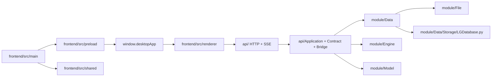
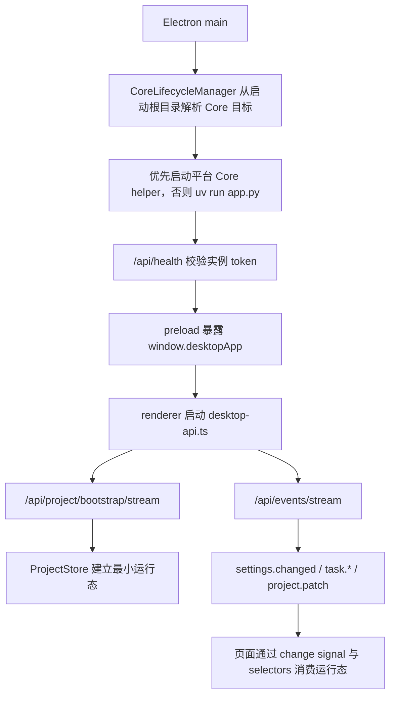
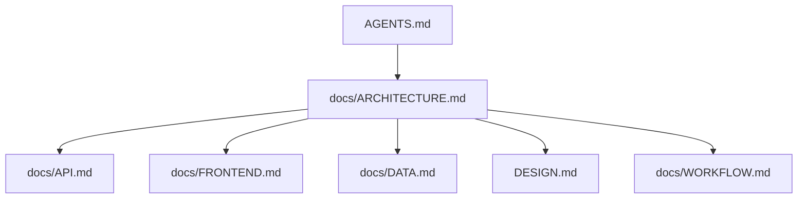

# LinguaGacha 架构文档

## 一句话总览
LinguaGacha 是“无头 Python Core + Electron 桌面前端”的双进程工程。本文只回答系统如何分层、跨层边界在哪里、运行时主链路如何流动，以及读哪份文档才能做出正确维护判断。

## 系统分层图

分层规则：
- `frontend/src/main` 只处理 Electron 宿主、窗口、原生对话框和开发态调试入口。
- `frontend/src/preload` 只负责通过 `contextBridge` 暴露 `window.desktopApp`。
- `frontend/src/renderer` 只通过 `window.desktopApp` 和 `desktop-api.ts` 接入宿主与 Core API。
- `api/` 是 Python Core 对前端与 Python 客户端暴露的唯一协议边界。
- `module/Data` 持有工程事实，`module/Engine` 持有任务生命周期，`module/File` 持有格式解析与写回，`module/Model` 持有模型配置领域规则。

## 跨层边界

| 边界 | 当前规则 | 为什么重要 |
| --- | --- | --- |
| Renderer -> Electron | 只能走 `window.desktopApp` | 防止页面绕过 preload 直接碰 Node / Electron |
| Renderer -> Python Core | 只能走 `frontend/src/renderer/app/desktop-api.ts` -> `api/` | 保持前后端协议单点可维护 |
| API -> Data | 工程事实、规则、分析与校对辅助由 `module/Data` 提供 | 防止 API 层直接拼装会话与数据库 |
| API -> Engine | 后台任务启动、停止、进度与终态语义由 `module/Engine` 提供 | 防止数据层和界面层偷持任务生命周期 |
| Data -> File | 外部文件解析与写回只能委托 `module/File` | 防止格式支持散落在工程服务里 |
| Data -> Storage | SQL 只允许落在 `module/Data/Storage/LGDatabase.py` | 防止事务与 schema 规则碎裂 |

仓库级不变量：
- `api/` 之外不新增前后端并行协议边界。
- SQL 只允许落在 `module/Data/Storage/LGDatabase.py`；API 层不得直接持有数据库连接或 `ProjectSession`。
- 长期用户文案分成两处维护：Python Core 在 `module/Localizer/`，渲染层在 `frontend/src/renderer/i18n/`。
- 跨层载荷优先传 `id`、值对象或不可变快照，不共享可变对象引用。

## 运行时主链路

运行时主链路的稳定事实：
- Electron main 是 Python Core 伴生进程的生命周期拥有者；启动时由 `CoreLifecycleManager` 在高位端口范围内选择本机端口，并从启动根目录优先拉起平台 Core helper（Windows 为 `core.exe`，macOS / Linux 为 `core`），不存在时回退到 `uv run app.py`，再校验 `/api/health` 实例 token 并创建窗口。开发态启动根目录优先取 npm 保留的原始目录 `INIT_CWD`，不存在时回退到 Electron 主进程当前工作目录；打包态启动根目录固定为 Electron 可执行文件所在目录，macOS 为 `.app/Contents/MacOS`。
- Python Core 的运行时路径统一收敛为两根：`APP_ROOT` 是应用根，开发态为仓库根、发布态为程序运行目录，承载 `resource/`、`version.txt` 和 Core 启动目标；`DATA_ROOT` 是可写数据根，承载 `userdata/` 与 `log/`。AppImage 与 macOS `.app` 固定把 `DATA_ROOT` 放到 `~/LinguaGacha`，其他场景优先使用可写的 `APP_ROOT`，不可写时回退 `~/LinguaGacha`。
- Electron 侧 Core API 地址由 `CoreLifecycleManager` 写入 `LINGUAGACHA_CORE_API_BASE_URL`；`frontend/src/shared/core-api-base-url.ts` 仍保留环境变量、启动参数和默认端口解析，供 preload 与外部调试兼容。
- 应用退出时 Electron main 会优先调用内部 `/api/lifecycle/shutdown`，失败或超时后按平台清理 Core 进程树；渲染层不直接管理后端进程。
- 渲染层项目运行态由 bootstrap 首包和事件流共同驱动，而不是单次整页快照。
- `ProjectStore` 是渲染层项目运行态最小事实仓库；页面本地筛选、弹窗、交互态不应上提到这里。
- 校对页不会把 warnings、筛选面板 facets、搜索排序结果等派生事实塞回 `ProjectStore`；这些派生缓存由独立 worker 持有，主线程只同步原始 `project / items / quality` 输入并消费查询结果。

## 文档地图与推荐阅读顺序

| 场景 | 推荐阅读顺序 |
| --- | --- |
| 仓库整体结构与跨层关系 | `ARCHITECTURE（架构文档）` |
| HTTP / SSE 契约、bootstrap、topic、错误码 | `ARCHITECTURE` -> `API` |
| Electron 壳层、preload、renderer、`ProjectStore` | `ARCHITECTURE` -> `FRONTEND` |
| 页面设计语言、视觉权威来源、组件语义 | `ARCHITECTURE` -> `DESIGN` -> `FRONTEND` |
| Python Core 数据域、状态落点、唯一写入口 | `ARCHITECTURE` -> `DATA` |
| 验证矩阵、文档同步与交付要求 | `WORKFLOW` |

## 模块关系矩阵

| 模块 | 核心职责 | 主要邻接层 | 详细规则所在 |
| --- | --- | --- | --- |
| `api/` | 本地 HTTP / SSE 契约、bootstrap、错误映射、事件桥 | `frontend/src/renderer`、`api/Client`、`module/*` | [`API.md`](./API.md) |
| `frontend/` | Electron 宿主、bridge、React 渲染层、`ProjectStore` 消费 | `api/`、根目录 `DESIGN.md` 对应的前端语义 | [`FRONTEND.md`](./FRONTEND.md) |
| `module/Data` | 工程事实、规则、分析、翻译结果、校对辅助 | `api/`、`module/File`、`Storage` | [`DATA.md`](./DATA.md) |
| `module/Engine` | 后台任务生命周期、请求调度、停止与重试 | `api/`、`module/Data` | [`DATA.md`](./DATA.md) |
| `module/File` | 文件格式解析、资产读取、导出写回 | `module/Data` | [`DATA.md`](./DATA.md) |
| `module/Model` | 模型配置类型、模板补齐、排序与默认回退 | `api/`、`Config` | [`DATA.md`](./DATA.md) |
| 根目录 `DESIGN.md` 对应权威源 | 视觉 token、壳层节奏、页面骨架、组件语义 | `frontend/src/renderer` | [`DESIGN.md`](../DESIGN.md) |

## 维护约束

- 本文只保留系统分层、运行时主链路、跨层边界和文档地图，不平铺 API 字段表、样式 token 或任务流程清单。
- 若一次改动会改变阅读路径、模块关系矩阵或跨层边界，必须同步更新本文。
- 若你发现一条规则更适合 `API`、`FRONTEND`、`DESIGN`、`WORKFLOW` 或 `DATA`，就把它迁过去，不要继续把本文写成并行总纲。
