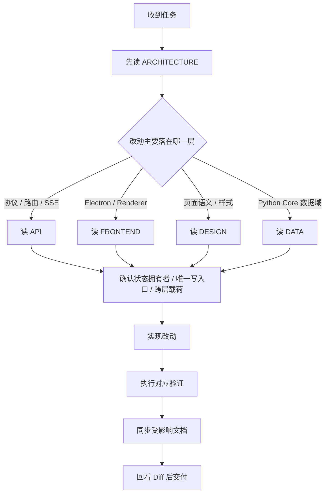

# LinguaGacha 工作流文档

## 任务起手式

执行原则：
- 先确认信息去留与归宿，再动代码或文档。
- 同一改动若横跨多层，验证和文档同步都按并集执行。
- 文档只记录未来维护必须知道、且不能轻易从代码表面读出的当前有效事实。
- 发布打包版本号以 `version.txt` 为唯一事实源，文件内容保持不带 `v` 的纯数值形式；`pyproject.toml` 与 `frontend/package.json` 的 `version` 保持 `0.0.0` 占位，CI 构建前再临时注入真实版本。手动发布流水线稳定产物为 Windows x64 zip、macOS x64 / arm64 DMG 与 Linux x64 AppImage；每次成功构建后固定创建 GitHub Release 草稿，不自动正式发布。日志、标题、User-Agent 等需要带 `v` 的展示位置由调用处自行拼接。

## 常见任务类型的阅读路径

| 任务类型 | 阅读顺序 |
| --- | --- |
| 仓库结构、阅读入口、跨层关系 | `ARCHITECTURE` |
| 本地 HTTP / SSE 契约、bootstrap、topic、错误码 | `ARCHITECTURE` -> `API` |
| Electron 壳层、preload、共享桥接、渲染层分层 | `ARCHITECTURE` -> `FRONTEND` |
| React 页面、组件、样式、交互语义 | `ARCHITECTURE` -> `DESIGN` -> `FRONTEND` |
| Python Core 数据域、状态落点、唯一写入口 | `ARCHITECTURE` -> `DATA` |
| 任务执行、验证矩阵、交付要求 | `WORKFLOW` |

## 最低验证要求

| 变更类型 | 最低验证 |
| --- | --- |
| Python 业务逻辑、数据流、API 行为变化 | `uv run ruff format` -> `uv run ruff check --fix` -> `uv run pytest` |
| API 契约、错误码、SSE topic、bootstrap 变化 | `uv run ruff format` -> `uv run ruff check --fix` -> `uv run pytest`，并补齐或更新相关 API 测试 |
| Electron 主进程、preload、共享桥接变化 | `npm --prefix frontend run format`、`npm --prefix frontend run format:check`、`npm --prefix frontend run lint`、`npm --prefix frontend exec -- tsc -p frontend/tsconfig.node.json --noEmit` |
| 渲染层结构、组件契约、样式边界、导航变化 | `npm --prefix frontend run format`、`npm --prefix frontend run format:check`、`npm --prefix frontend run lint`、`npm --prefix frontend run renderer:audit`、`npm --prefix frontend exec -- tsc -p frontend/tsconfig.json --noEmit`、`npm --prefix frontend exec -- tsc -p frontend/tsconfig.node.json --noEmit` |
| 仅文档改动 | 自检链接、命名、阅读路径、权威来源和文档边界是否仍然准确 |

补充规则：
- 若同时改动 Python 与前端，执行两边验证的并集。
- 若任务只改文档，但文档声称某个实现边界已变化，就必须先确认代码真相再交付。

## 文档同步规则

长期权威文档固定收口为：
- `AGENTS.md`
- `docs/ARCHITECTURE.md`
- `docs/API.md`
- `docs/FRONTEND.md`
- `DESIGN.md`
- `docs/WORKFLOW.md`
- `docs/DATA.md`

不参与长期权威竞争的 Markdown：
- `README*.md` 面向用户、发布页和公开项目介绍，不承载 Agent 维护规则。
- `.codex/skills/**` 是技能说明，按技能生命周期维护。
- `output/**`、`input_bak/**`、`.pytest_cache/**` 是生成物、样例、缓存或临时材料，有明确子目录与生命周期。

| 变更内容 | 必须同步 |
| --- | --- |
| 系统分层、跨层边界、阅读路径、模块关系矩阵 | `docs/ARCHITECTURE.md` |
| 路由前缀、响应壳、错误码、bootstrap、SSE topic、`project.patch`、同步 mutation 规则 | `docs/API.md` |
| `main / preload / shared / renderer` 分层、`window.desktopApp`、`desktop-api.ts`、`ProjectStore`、导航映射、样式归属 | `docs/FRONTEND.md` |
| 视觉 token 权威来源、页面骨架、稳定组件语言、主题语义 | `DESIGN.md` |
| 数据域职责、状态落点、唯一写入口、SQL 落点、文件格式分发、模型配置规则 | `docs/DATA.md` |
| Agent 协作入口、仓库级硬约束、最低验证与交付要求 | `AGENTS.md` |

同步原则：
- 若同一改动同时影响架构边界与设计语义，先更新权威文档，再调整实现与局部说明。
- 文档之间只保留一个权威版本；其他文档只做必要引用，不复制大段规则。
- 长期文档只陈述当前有效规则；任务过程、阶段性方案和变更叙事留给 Git、PR 或任务记录。
- 删除或迁移遗留文档前，要同步检查脚本报错、README、技能提示和测试断言中的文档链接；工具链入口不得继续指向已迁空的目录级 `SPEC.md`。

## 交付前自检清单

1. 这次改动的状态拥有者、唯一写入口和跨层载荷是否仍然清楚。
2. Diff 中是否出现把协议边界、任务语义、样式语义散到错误层级的情况。
3. 对应验证是否已经执行；若未执行或失败，是否已记录原因与影响范围。
4. 受影响的长期文档是否已经同步，且没有留下坏链接或重复正文。
5. 若涉及前端视觉改动，是否已经按 `DESIGN.md` 的权威来源核对。

## 交付要求

- 交付前必须回看 Diff，确认命名、注释、实现边界和文档边界仍然一致。
- 若验证未执行、执行失败，或只完成了部分验证，必须在交付说明中明确写出原因与影响范围。
- 若任务涉及前端视觉改动，交付时要明确说明是否依照 `DESIGN.md` 完成核对。
